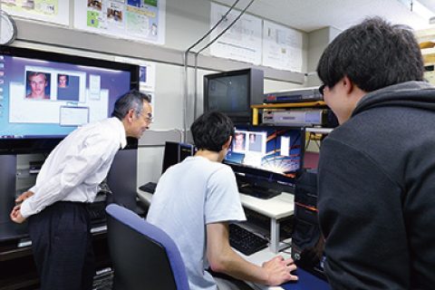

# 情報工学科の紹介
<!-- Markdown記法を使って学科の紹介ページを作る -->
　＜情報工学科とは？＞
基礎スキルから高度なスキルを段階的に学べるプログラミング教育、進路を見据えた幅広いコース選択によって着実な知識を身につけ、卒業研究によって、主体性、課題に対する洞察力、解決のためのコミュニケーション能力等、実社会に役立つ総合的能力を修得する学科！

　
＜どんなことをするの？＞
主に上の通りだがより詳しく説明すると、三つのコースをそれぞれ専攻します。

１.システムエンジニアリングコース
プログラミングを基礎から学び、自在にコンピュータを制御するソフトウェアや情報システムの設計技術を修得していきます。モバイルシステムのような身近なものから“富岳”のようなスーパーコンピュータを使う大規模かつ高度なものまで、時代に必要とされる情報システムを創造するエンジニアを育成します。

２.インターネット＆セキュリティコース
昨今の情報化社会は、私たちの暮らしをとても豊かなものにしてきましたが、その一方で、これまでにはみられなかった様々な脅威が発生しています。それらから私たちの暮らしを守り、安全で安心できる情報社会を構築するために、ネットワーク技術や情報セキュリティ対策などについて学びます。

３.知能情報コース
あらゆるモノがネットワークに繋がるIoT、さまざまなコトに繋げるビッグデータ解析や人工知能は、既に私たち人間にとって日常の一部になっています。これらの知識・技術を基礎から応用まで学び、目覚しく変化する情報社会の新しい今後を創り出す専門家の育成を目指します。😄

<主な就職先は？>
・機器関連メーカー
・電子機器メーカー
・各種デザイナー
・コンピュータ関連産業
・医療機器メーカー
・研究開発　など！

＜情報工学科の生徒に関する情報！＞

｜生徒数｜留学生数｜
｜３５６｜１４　　｜

参考文献：https://feng.takushoku-u.ac.jp/course/cs/introduction.html

<!-- この部分より上に記述を追加して下のチェックボックスで確認する -->
- [ ] 2種類以上の見出し(headers)を使っている．
- [ ] 2種類以上の強調(emphasis)を使っている．
- [ ] (番号付きの)リスト(ordered lists)を使っている
- [ ] (番号無しの)リスト(unordered lists)を使っている．
- [ ] 1つ以上の画像(images)を使っている．
- [ ] 1つ以上のリンク(links)を使っている．
- [ ] 1つ以上の表(tables)を使っている．
- [ ] 1つ以上の絵文字を使っている．
